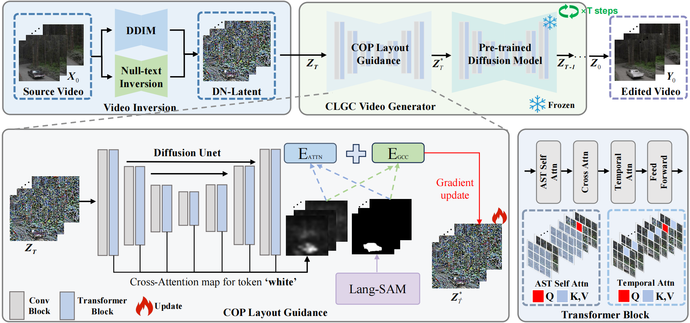

Hi there! I am a first-year Ph.D. student at [Nanjing University of Posts and Telecommunications](https://www.njupt.edu.cn/). My research interests revolve around **computer vision**, **generative AI**, and **diffusion models**, with a special focus on **controllable video generation**. 

I am fortunate to be advised by [Prof. Bingkun Bao](https://www.scholat.com/bkbao.cn) at the [Multimedia Cognitive Computing Lab](https://mcclab.njupt.edu.cn/main.htm). Together, we explore cutting-edge research in multimedia and artificial intelligence. 

If you have any questions about my projects or want to collaborate, feel free to drop me an email at **2024010131@njupt.edu.cn**. I’m always happy to connect and share ideas! 💡🤝

---

# ✨ News  
* 🎉 **2025-05:** Our paper **CLGC** has been selected for an **Oral Presentation** in [ICME 2025](https://2025.ieeeicme.org/)!
* 🎉 **2025-04:** Our paper **CLGC** has been **accepted** to [ICME 2025](https://2025.ieeeicme.org/)! 

# 📝 Publications  

Here is a list of my selected publications. For more details, feel free to check out my [Google Scholar](#) or [ResearchGate](#) profiles. 📚✨  

<table style="width:100%;border:0px;border-spacing:0px;border-collapse:separate;margin-right:auto;margin-left:auto;">
  <tbody>  

  <!-- CLGC -->
  <tr>
    <td style="padding:20px;width:30%;max-width:30%;" align="center">
      
    </td>
    <td width="75%" valign="center">
      <papertitle><b>[CLGC: Continuous Layout Guidance for Consistent Text-to-Video Editing](#)</b></papertitle>  
       
      <b><b>Xuancheng Xu</b>, Ming Tao, Bing-Kun Bao*</b>  
       
      <em>IEEE International Conference on Multimedia & Expo (ICME), 2025. <b>Oral</b></em>  
       
      
An advanced framework leveraging layout guidance for consistent and efficient text-to-video editing.
  
    </td>
  </tr>  

  </tbody>
</table>
